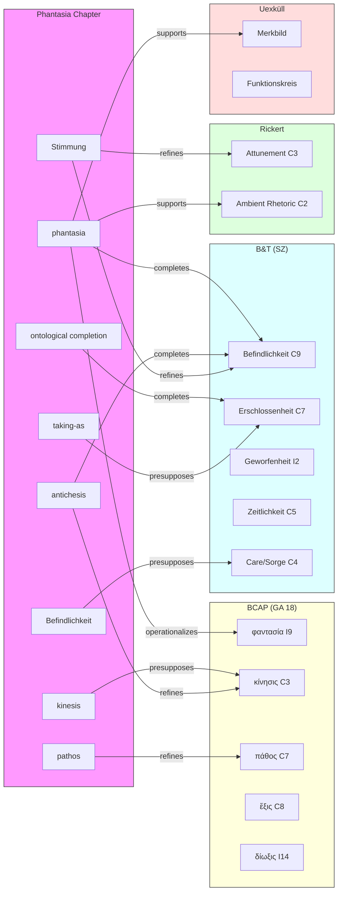

# Phase 4 — Cross-Pipeline Bridge

**Pipeline**: Phantasia Chapter Analysis
**Status**: COMPLETE
**Date**: 2026-03-10
**Deliverable**: Cross-pipeline integration mapping (phantasia ↔ BCAP, B&T, Rickert, Uexküll)

---

## 4A. Bridge Summary

| Pipeline | Priority | Confidence | Shared Nodes | Bridge Edges | Textual Basis |
|----------|----------|------------|:------------:|:------------:|---------------|
| BCAP (GA 18) | HIGH | [EXPLICIT] | 11 | 18 | Chapter directly cites GA 18; dioxis/phyge, phantasia as I9 node |
| B&T (SZ) | HIGH | [EXPLICIT] | 9 | 15 | Ch 2 uses §§28-29 extensively; Befindlichkeit/Stimmung framework |
| Rickert | LOW | [INTERP-low] | 3 | 4 | One reference to "ambient disclosure" in Doc D only |
| Uexküll | SPECULATIVE | [INTERP-speculative] | 2 | 3 | Zero references in any document; connection inferred from prior analysis |

**Total bridge edges**: 40

---

## 4B. BCAP Bridge (HIGH Priority)

### 4B.1 Shared Node Mapping

| Phantasia Node | BCAP Node | Relationship | Confidence |
|----------------|-----------|-------------|------------|
| phantasia | φαντασία (I9) | **identity** — same concept, different analytical depth | [EXPLICIT] |
| kinesis | κίνησις (C3) | **identity** — Ch 1 T0 ground = BCAP core ontological category | [EXPLICIT] |
| pathos | πάθος (C7) | **identity** — Ch 1 T2/T6 = BCAP rhetorical/existential affection | [EXPLICIT] |
| hexis | ἕξις (C8) | **identity** — habituated phantasia ground = BCAP dispositional concept | [EXPLICIT] |
| doxa/krisis | δόξα (P3) | **identity** — Ch 1 T5 = BCAP opinion/judgment | [EXPLICIT] |
| orexis | ὄρεξις (I5) | **identity** — Ch 1 T6 desire = BCAP appetitive motion | [EXPLICIT] |
| chronos | χρόνος (I2) | **identity** — Ch 1 T0 temporal ground = BCAP Physics IV time | [EXPLICIT] |
| dynamis | δύναμις (C6) | **identity** — Ch 1 T1 perceptual potentiality = BCAP potentiality | [EXPLICIT] |
| energeia | ἐνέργεια (C5) | **identity** — Ch 1 T1-T2 actualization = BCAP actuality | [EXPLICIT] |
| dioxis (via orexis) | δίωξις (I14) | **refines** — Ch 1 T6 pursuit = BCAP Heidegger's reading of Aristotelian pursuit | [EXPLICIT] |
| phyge (via orexis) | φυγή (I15) | **refines** — Ch 1 T6 avoidance = BCAP Heidegger's reading of Aristotelian avoidance | [EXPLICIT] |

### 4B.2 Bridge Edges

| # | Source (Phantasia) | Relation | Target (BCAP) | Domain | Confidence | Note |
|---|-------------------|----------|---------------|--------|------------|------|
| 1 | phantasia | operationalizes | φαντασία (I9) | cognitive | [EXPLICIT] | Phantasia chapter gives φαντασία the full T-stage temporal mechanism that BCAP leaves undeveloped |
| 2 | phantasia | refines | φόβος presupposes φαντασία (BCAP edge) | affective | [EXPLICIT] | Ch 1 explains WHY φόβος presupposes φαντασία: the T-stage chain (aisthesis → residual motion → phantasma → doxa → pathos) |
| 3 | kinesis | presupposes | κίνησις (C3) | kinetic | [EXPLICIT] | T0 ground inherits BCAP's Physics Γ ontology of motion |
| 4 | pathos | refines | πάθος (C7) | affective | [EXPLICIT] | Chapter disambiguates pathos into T2 (raw being-affected) vs T6 (structured emotional response via tripartite formula) |
| 5 | habituated_phantasia | depends_on | ἕξις (C8) | cognitive | [EXPLICIT] | Author's concept draws directly on BCAP's dispositional hexis |
| 6 | T-stage schema | explains | φαντασία → φόβος dependency (BCAP) | kinetic/affective | [EXPLICIT] | T-stage gives the MECHANISM for BCAP's bare "presupposes" edge |
| 7 | antichesis | refines | κίνησις (C3) | kinetic | [INTERP-high] | Antichesis (internal resonance) is a species of kinesis specific to the soul's reception of form |
| 8 | apoleipomene_kinesis | depends_on | κίνησις (C3) | kinetic | [EXPLICIT] | Residual motion is a subspecies of BCAP's motion ontology |
| 9 | affective_architecture | operationalizes | πάθος (C7) | affective | [INTERP-high] | The 6-component architecture (aisthesis → phantasma → doxa → krisis → pathos → orexis) operationalizes BCAP's general pathos |
| 10 | orexis | presupposes | ὄρεξις (I5) | affective/kinetic | [EXPLICIT] | Chapter's T6 desire/action inherits BCAP's appetitive framework |
| 11 | dioxis | operationalizes | δίωξις (I14) | kinetic | [EXPLICIT] | T6 pursuit is the terminal kinetic output of the T-stage chain |
| 12 | phyge | operationalizes | φυγή (I15) | kinetic | [EXPLICIT] | T6 avoidance is the complementary terminal output |
| 13 | doxa/krisis | refines | δόξα (P3) | cognitive | [EXPLICIT] | Chapter specifies doxa as T5 product of phantasia's "taking-as," not free-standing judgment |
| 14 | chronos | presupposes | χρόνος (I2) | temporal | [EXPLICIT] | T0 temporal ground = BCAP Physics IV time; asymmetric dependency (time depends on motion) |
| 15 | deliberative_phantasia | depends_on | φρόνησις (I13) | cognitive | [INTERP-high] | Deliberative phantasia enables practical wisdom by providing phantasmata for comparison |
| 16 | sensitive_phantasia | depends_on | αἴσθησις (I1) | perceptual | [EXPLICIT] | Sensitive phantasia is the aisthesis-proximate mode |
| 17 | taking_as | refines | λόγος (C1) | cognitive | [INTERP-high] | "Taking-as" (phantasia's core operation) parallels but is pre-linguistic vs BCAP's λόγος |
| 18 | resonant_motion | refines | κίνησις (C3) | kinetic | [INTERP-high] | Author's coined term for the specific kinetic modality within the soul |

### 4B.3 Key Integration Insight

BCAP establishes that Heidegger reads Aristotle's πάθος as anticipating Befindlichkeit and that φόβος (fear) presupposes φαντασία. But BCAP does not develop the MECHANISM of this presupposition. The phantasia chapter supplies that mechanism: the T-stage chain (T1 aisthesis → T2 residual kinesis → T3 phantasma crystallization → T5 doxa → T6 pathos/orexis). This makes the phantasia pipeline a **mechanistic completion** of BCAP's structural claim.

The BCAP pipeline's treatment of φαντασία as an "important" (not "core") node (I9) is itself significant — it reflects Heidegger's relative neglect of phantasia in favor of λόγος. The phantasia chapter argues this neglect is a gap: Heidegger needed phantasia to bridge his own Befindlichkeit/Stimmung analysis back to Aristotle's perceptual psychology.

---

## 4C. B&T Bridge (HIGH Priority)

### 4C.1 Shared Node Mapping

| Phantasia Node | B&T Node | Relationship | Confidence |
|----------------|----------|-------------|------------|
| Stimmung | State-of-mind/Befindlichkeit (C9) | **refines** — Ch 2 uses Stimmung as ontic manifestation of Befindlichkeit | [EXPLICIT] |
| Befindlichkeit | State-of-mind/Befindlichkeit (C9) | **identity** — same existential structure | [EXPLICIT] |
| Erschlossenheit | Disclosedness/Erschlossenheit (C7) | **identity** — phantasia as Aristotelian mode of disclosure | [EXPLICIT] |
| Geworfenheit | Thrownness/Geworfenheit (I2) | **identity** — mood discloses thrownness | [EXPLICIT] |
| Sorge | Care/Sorge (C4) | **presupposes** — Befindlichkeit is a structural moment of Care | [EXPLICIT] |
| Bedeutsamkeit | Significance/Bedeutsamkeit (I5) | **identity** — Stimmung discloses significance | [EXPLICIT] |
| Verstehen | Understanding/Verstehen (C8) | **contrasts_with** — Ch 2 focuses on Befindlichkeit, not Verstehen | [EXPLICIT] |
| Rede | Discourse/Rede (I9) | **contrasts_with** — not developed in Ch 2 | [EXPLICIT] |
| Zeitlichkeit | Temporality/Zeitlichkeit (C5) | **contrasts_with** — ecstatic temporality vs chronos (physical time) | [EXPLICIT] |

### 4C.2 Bridge Edges

| # | Source (Phantasia) | Relation | Target (B&T) | Domain | Confidence | Note |
|---|-------------------|----------|--------------|--------|------------|------|
| 1 | Stimmung | refines | Befindlichkeit (C9) | existential | [EXPLICIT] | Ch 2 treats Stimmung as the ontic side of Befindlichkeit (§29 H.134) |
| 2 | phantasia | completes | Befindlichkeit (C9) | existential/perceptual | [INTERP-high] | Chapter's thesis: phantasia supplies the imagistic mechanism that Befindlichkeit's account of disclosure lacks |
| 3 | Erschlossenheit | presupposes | Disclosedness (C7) | existential | [EXPLICIT] | Phantasia is Aristotle's version of imagistic disclosure; parallels Erschlossenheit |
| 4 | Geworfenheit | explains | Thrownness (I2) | existential | [EXPLICIT] | Mood's involuntariness parallels phantasia's involuntariness — both disclose without choice |
| 5 | Stimmung | contrasts_with | chronos → Zeitlichkeit | temporal | [EXPLICIT] | Stimmung is pre-temporal horizon; chronos is physical sequential time. Key Ch 2 contrast. |
| 6 | ontological_completion | completes | Being-in-the-world (C3) | existential | [INTERP-high] | Chapter argues the Greek mechanism (phantasia) + German horizon (Stimmung) together complete the account of Being-in-the-world |
| 7 | resonant_affect | refines | Befindlichkeit (C9) | affective/existential | [INTERP-high] | Resonant affect names the specific modality of Befindlichkeit when phantasia is operative |
| 8 | antichesis | completes | Befindlichkeit (C9) | kinetic/existential | [INTERP-high] | Antichesis (internal resonance) is the mechanism missing from Heidegger's Befindlichkeit — how mood *works* at the soul level |
| 9 | dual_trace | refines | Temporality (C5) | temporal | [INTERP-high] | Dual trace (crystallization + reverberation) is the bidirectional temporal structure that mediates between chronos and Zeitlichkeit |
| 10 | Bedeutsamkeit | depends_on | Significance (I5) | existential | [EXPLICIT] | Ch 2: Stimmung discloses Bedeutsamkeit — the field of significant relations |
| 11 | Sorge | presupposes | Care (C4) | existential | [EXPLICIT] | Befindlichkeit is a structural moment of Sorge |
| 12 | 4-step schema | operationalizes | Befindlichkeit → understanding (B&T §31) | existential | [INTERP-high] | Stimmung→Phantasia→Doxa→Pathos operationalizes the transition from mood to structured response |
| 13 | tripartite temporal formula | refines | ecstatic temporality (C5) | temporal | [INTERP-high] | Three temporal dimensions (past residue, present resonance, future projection) map to Heidegger's three ecstases |
| 14 | taking_as | presupposes | As-structure/Auslegung (I4) | cognitive/existential | [INTERP-high] | Phantasia's "taking-as" is a pre-hermeneutic version of the B&T "as-structure" |
| 15 | Verstehen | contrasts_with | Understanding (C8) | existential | [EXPLICIT] | Ch 2 deliberately foregrounds Befindlichkeit over Verstehen — this is a strategic choice |

### 4C.3 Key Integration Insight

The phantasia chapter's central argument is that Heidegger's Befindlichkeit/Stimmung analysis in B&T §29 provides the existential HORIZON (mood as pre-understanding) but lacks the perceptual MECHANISM (how mood actually operates through imagistic presentation). Conversely, Aristotle's phantasia provides the mechanism (T-stage chain) but lacks the existential horizon (Stimmung as pre-temporal attunement). The chapter proposes that BOTH are needed: **phantasia is the mechanism, Stimmung is the horizon**.

This creates a distinctive bridge pattern: not mere influence or derivation, but **mutual completion**. The `completes` edge type (used 3 times above) captures relationships where neither concept is sufficient alone.

The asymmetry documented in the German terminology appendix (Aristotle has phantasia/phantasma/aisthesis/doxa that Heidegger lacks; Heidegger has Stimmung/Geworfenheit/Bedeutsamkeit that Aristotle lacks) is the structural basis for this mutual completion thesis.

---

## 4D. Rickert Bridge (LOW Priority)

### 4D.1 Shared Node Mapping

| Phantasia Node | Rickert Node | Relationship | Confidence |
|----------------|-------------|-------------|------------|
| Stimmung | Attunement/Stimmung (C3) | **refines** — same concept, different valence: Rickert's Stimmung is rhetorical-ecological; phantasia's is existential-perceptual | [INTERP-low] |
| Erschlossenheit | Disclosure/Aletheia (C4) | **supports** — both treat disclosure as non-propositional opening | [INTERP-low] |
| phantasia | Ambient Rhetoric (C2) | **supports** — phantasia as a mode of ambient (non-deliberate) disclosure parallels Rickert's ambient rhetoric | [INTERP-low] |

### 4D.2 Bridge Edges

| # | Source (Phantasia) | Relation | Target (Rickert) | Domain | Confidence | Note |
|---|-------------------|----------|-----------------|--------|------------|------|
| 1 | Stimmung | refines | Attunement/Stimmung (C3) | existential | [INTERP-low] | Rickert's Stimmung draws on same B&T §29 source but extends toward ecology/dwelling; phantasia chapter stays within perceptual psychology |
| 2 | phantasia | supports | Ambient Rhetoric (C2) | rhetorical | [INTERP-low] | Phantasia as involuntary imagistic presentation parallels Rickert's "ambient" (non-deliberate) disclosure |
| 3 | taking_as | supports | Disclosure/Aletheia (C4) | cognitive/rhetorical | [INTERP-low] | Phantasia's "taking-as" is a pre-rhetorical disclosure operation; Rickert's aletheia is post-rhetorical |
| 4 | antichesis | supports | Ambience (C1) | kinetic/ecological | [INTERP-speculative] | Internal resonance (antichesis) and environmental ambience share a structural pattern: non-intentional, pervasive, pre-reflective |

### 4D.3 Key Integration Insight

The Rickert bridge is thin but not trivial. Doc D (alt-org) mentions "ambient disclosure" once, suggesting the author is aware of Rickert's framework as a possible horizon for the phantasia argument. The key structural parallel: both Rickert's ambient rhetoric and the phantasia chapter's account of phantasia describe forms of disclosure that are **involuntary, pre-reflective, and pervasive** — mood and imagination both operate before deliberate rhetorical activity. However, Rickert's ecological/environmental emphasis (dwelling, fourfold, ecology) is absent from the phantasia chapter, which stays within Aristotelian perceptual psychology and Heideggerian existential analysis.

**Potential Phase 5 development**: If the dissertation develops a chapter on rhetorical ontology that connects Aristotle's phantasia to Rickert's ambient rhetoric, the bridge edges here would be upgraded from [INTERP-low] to [INTERP-high] or [EXPLICIT].

---

## 4E. Uexküll Bridge (SPECULATIVE)

### 4E.1 Shared Node Mapping

| Phantasia Node | Uexküll Node | Relationship | Confidence |
|----------------|-------------|-------------|------------|
| phantasia | Merkbild (perception-image) | **supports** — phantasia as species-specific perceptual presentation ≈ Merkbild as species-specific perception-sign | [INTERP-speculative] |
| Stimmung | Stimmung (centrality 4) | **supports** — Uexküll's Stimmung operates at the organism-environment interface; phantasia's at the existential-perceptual interface | [INTERP-speculative] |

### 4E.2 Bridge Edges

| # | Source (Phantasia) | Relation | Target (Uexküll) | Domain | Confidence | Note |
|---|-------------------|----------|------------------|--------|------------|------|
| 1 | phantasia | supports | Merkbild | biosemiotic/perceptual | [INTERP-speculative] | Both are species-specific imagistic presentations: phantasia for human souls, Merkbild for animal Umwelten |
| 2 | Funktionskreis (T-stage analogue) | supports | Funktionskreis | biosemiotic/kinetic | [INTERP-speculative] | T-stage chain (perception → image → action) structurally parallels Funktionskreis (Merkmal → Merkbild → Wirkmal → Wirkbild) |
| 3 | Stimmung | supports | Stimmung (Uexküll) | existential/biosemiotic | [INTERP-speculative] | Both use Stimmung as a non-propositional disclosure mode, but at different levels (existential vs organism-environment) |

### 4E.3 Key Integration Insight

There are **zero** references to Uexküll in any of the five phantasia source documents. This bridge is entirely inferential, based on structural parallels identified in prior pipeline analysis. The strongest parallel is between the T-stage chain and the Funktionskreis: both describe a closed loop from perception through image to action, with the image (phantasma / Merkbild) serving as the mediating representation. However, this parallel is structurally suggestive rather than textually grounded.

**Potential Phase 5 development**: If the dissertation develops a chapter on biosemiotic rhetoric (connecting Aristotle's phantasia to Uexküll's Umwelt theory via Heidegger's reading of both), these edges would be upgraded. The cross-pipeline edge `Umwelt ↔ Being-in-the-world` (already established in the Uexküll pipeline) would provide the Heideggerian bridge.

---

## 4F. Cross-Pipeline Tension Candidates

| # | Tension | Pipelines | Type | Status |
|---|---------|-----------|------|--------|
| T-CP1 | **Phantasia as mechanism vs Stimmung as horizon** — Can a Greek kinetic account (motion, time, perception) be integrated with a German existential account (mood, disclosure, care) without reducing one to the other? | Phantasia ↔ B&T | productive | The chapter's central thesis. Resolution: mutual completion, not subsumption. |
| T-CP2 | **φαντασία as "important" (BCAP I9) vs phantasia as central (Phantasia C1)** — Heidegger's relative neglect of phantasia in BCAP vs the chapter's claim that phantasia is essential to the pathos/Befindlichkeit account | Phantasia ↔ BCAP | productive | Chapter argues Heidegger SHOULD have made phantasia core; the gap is productive for the dissertation. |
| T-CP3 | **Deliberate rhetoric vs ambient disclosure** — Phantasia chapter operates within Aristotle's intentional rhetoric (Rhetoric II); Rickert's ambient rhetoric is explicitly non-intentional | Phantasia ↔ Rickert | unresolved | Would need a chapter connecting deliberative and ambient modes. |
| T-CP4 | **Human phantasia vs animal Merkbild** — Phantasia is presented as uniquely human (deliberative phantasia, nous-dependence); Uexküll's Merkbild operates across all species | Phantasia ↔ Uexküll | speculative | The species-specificity question is not addressed in the phantasia chapter. |

---

## 4G. Bridge Mermaid Graph

---

## 4H. Phase 4 Decision Log

| # | Decision | Rationale |
|---|----------|-----------|
| D4-1 | Used `completes` as primary edge type for B&T bridge | Chapter's argument is mutual completion (not derivation, not influence). Neither phantasia nor Stimmung is sufficient alone. |
| D4-2 | Treated BCAP bridge as `operationalizes` + `refines` | Phantasia chapter provides the mechanism for BCAP's structural claims (e.g., φόβος presupposes φαντασία). |
| D4-3 | Kept Rickert at [INTERP-low] despite structural parallels | Only one textual reference (Doc D "ambient disclosure"). Structural parallels are real but not developed in the chapter. |
| D4-4 | Kept Uexküll at [INTERP-speculative] | Zero textual references. Funktionskreis parallel is genuine but entirely inferential. |
| D4-5 | Created 4 cross-pipeline tension candidates | These are productive for dissertation planning, not problems to resolve. |
| D4-6 | antichesis bridges BOTH BCAP (kinesis) and B&T (Befindlichkeit) | Confirms Execution Note E3: antichesis is the hub node connecting Greek kinetic and German existential chains. |
