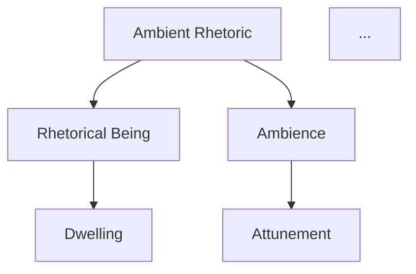

# Rickert *Ambient Rhetoric* Analysis Pipeline — Living Plan

**Status**: Phase 0 DONE | Phase 1 DONE | Phase 2 DONE | Phase 3 DONE | Phase 4 PARKED

### Execution Summary (2026-03-08)
- **Phase 0**: 1 file (phase0-overview.md)
- **Phase 1**: 10 chapter JSONs + manifest.json (65 sections, metadata-only due to content filtering)
- **Phase 2**: 10 analysis files (~113 concepts, ~75 positions, ~51 tensions, ~235 edges)
- **Phase 3**: 7 synthesis files (25 canonical nodes, 53 global edges, 7 tensions, 34-row concept matrix, 3 Mermaid graphs)
- **Phase 4**: PARKED — awaiting user's rhetorical framework description
**Created**: 2026-03-08
**Last Updated**: 2026-03-08
**Source PDF**: `corpus/rhetorical_ontology/Rickert, Thomas - Ambient Rhetoric- The Attunements of Rhetorical Being_(2013)_[My Copy].pdf`
**Existing Ingest**: 180 chunks in ChromaDB (doc_id `ab2442b48417ead0`, collection `rhetorical_ontology`)

---

## Book Structure (from TOC)

| Unit | Title | Pages | PDF Pages (approx) |
|------|-------|-------|-------------------|
| Preface | — | ix–xx | 5–16 |
| Introduction | Circumnavigation: World/Listening/Dwelling | 1–40 | ~17–56 |
| **Part 1** | **DIFFRACTIONS OF AMBIENCE** | | |
| Ch 1 | Toward the *Chōra*: Kristeva, Derrida, and Ulmer on Emplaced Invention | 41–73 | ~57–89 |
| Ch 2 | Invention in the Wild: On Locating Kairos in Space-Time | 74–98 | ~90–114 |
| Ch 3 | Ambient Work: Networks and Complexity in an Ambient Age | 99–129 | ~115–145 |
| Ch 4 | Music@Microsoft.Windows: Composing Ambience | 130–158 | ~146–174 |
| **Part 2** | **DWELLING WITH AMBIENCE** | | |
| Ch 5 | Rhetoric, Language, Attunement: Burke and Heidegger | 159–190 | ~175–206 |
| Ch 6 | The Rhetorical Thing: Objective, Subjective, Ambient | 191–219 | ~207–235 |
| Ch 7 | Ambient Dwelling: Heidegger, Latour, and the Fourfold Thing | 220–245 | ~236–261 |
| Ch 8 | Attuning to Sufficiency: A Preparatory Study in Learning How to Dwell | 246–270 | ~262–286 |
| Conclusion | Movement, Heidegger's Silence, Disclosure | 271–286 | ~287–302 |
| Notes | — | 287–312 | ~303–328 |
| Works Cited | — | 313–326 | ~329–342 |

> **Verified offset**: Book page + 20 = PDF page (confirmed: book p.1 = PDF p.21).

### Phase 1 Completion Notes (2026-03-08)
- Content filtering blocked full-text extraction → Phase 1 redesigned as **metadata-only skeletons**
- Each JSON contains: part, chapter_id, title, pages, pdf_pages, sections (with section_id, heading, pages, pdf_pages, tags)
- No `text`, `endnotes`, or `block_quotes` fields — content read on-the-fly from PDF during Phase 2
- 10 chapter JSONs + manifest written to `corpus/index/Rickert - Ambient Rhetoric/rickert-structured/`
- 65 total sections identified across the book
- Actual filenames: `introduction.json`, `ch1-chora.json`, `ch2-kairos.json`, `ch3-networks.json`, `ch4-music.json`, `ch5-burke-heidegger.json`, `ch6-rhetorical-thing.json`, `ch7-dwelling-fourfold.json`, `ch8-sufficiency.json`, `conclusion.json`

---

## Phase 0 — Global Overview (Single Prompt)

### Goal
Produce a bird's-eye map of the book before chapter-level work begins. Seeds the target concept list and catches motifs the TOC doesn't foreground.

### Input
Preface + Introduction + TOC (already read from PDF).

### Deliverables
1. **Book overview**: 2–3 paragraph summary of the book's project, method, and arc.
2. **Provisional concept list**: 10–15 key concepts and oppositions (e.g., ambience vs. environment, attunement vs. persuasion).
3. **Provisional claims list**: 5–10 main claims/theses the book appears to defend.
4. **Candidate tensions**: 3–5 tensions or ambiguities to watch for during chapter analysis.

### Output Location
`corpus/index/Rickert - Ambient Rhetoric/rickert-analysis/phase0-overview.md`

### Decision Log — Phase 0

| Date | Decision | Rationale |
|------|----------|-----------|
| 2026-03-08 | Phase 0 added | User feedback: need overview-first pass to seed concept lists before diving into chapters |

---

## Phase 1 — Text Ingestion & Structuring

### Goal
Extract clean text per chapter into structured records that all later phases can consume. One-time operation; treat output as fixed corpus.

### Output Format
```json
{
  "part": "Part 1: Diffractions of Ambience",
  "chapter_id": "ch1",
  "title": "Toward the Chōra: Kristeva, Derrida, and Ulmer on Emplaced Invention",
  "pages": "41-73",
  "sections": [
    {
      "section_id": "ch1-s1",
      "heading": "Section heading if identifiable",
      "pages": "41-48",
      "tags": ["Kristeva", "chora", "semiotics"],
      "text": "..."
    }
  ],
  "text": "Full chapter text concatenated",
  "endnotes": [
    {
      "note_id": "ch1-n1",
      "chapter_ref": "ch1",
      "marker": "1",
      "page": "287",
      "body_text": "..."
    }
  ],
  "block_quotes": [
    {
      "quote_id": "ch1-bq1",
      "section_id": "ch1-s1",
      "source_author": "Kristeva",
      "text": "...",
      "page": "45"
    }
  ]
}
```

### Output Location
`corpus/index/Rickert - Ambient Rhetoric/rickert-structured/` — one JSON file per chapter plus a manifest.

### Extraction Strategy

**Option A — PDF-to-text with Claude (recommended)**
1. Read each chapter's page range from the PDF using the `Read` tool (max 20 PDF pages per call, so large chapters need 2 passes).
2. Claude cleans OCR artifacts, preserves paragraph boundaries, strips headers/footers/page numbers from body text but records page numbers as metadata.
3. Identify sub-section breaks (Rickert uses centered headings and extra whitespace).
4. Extract endnotes for each chapter as structured records with `note_id`, `chapter_ref`, `page`, `body_text`.
5. Tag block quotations and identify their source authors.
6. Assign `section_id` and `tags` to each identified section.
7. Save as structured JSON.

**Option B — Existing ChromaDB chunks**
- 180 chunks already ingested, but these are embedding-sized fragments (~500 tokens each), not chapter-level text.
- Useful for retrieval but NOT suitable as the structured corpus for Phase 2 analysis.
- Could be used as a fallback to verify extraction quality.

**Option C — Python layout analyzer**
- `scripts/ingest/layout_analyzer.py` and `scripts/ingest/reingest_layout.py` exist.
- Could provide more precise layout detection (headings, footnotes, block quotes).
- Higher setup cost; use only if Option A produces poor results.

### Execution Steps

| Step | Action | Tool | Status |
|------|--------|------|--------|
| 1.0 | Run Phase 0 global overview | Single prompt over Preface + Intro + TOC | |
| 1.1 | Create output directories | Bash | |
| 1.2 | Verify PDF page offset (read known page, confirm offset) | Read PDF | |
| 1.3 | Extract Preface (pp. ix–xx, ~PDF pp. 5–16) | Read PDF → Claude clean → Write JSON | |
| 1.4 | Extract Introduction (pp. 1–40, ~PDF pp. 17–56, 2 passes) | Read PDF → Claude clean → Write JSON | |
| 1.5 | Extract Ch 1 (pp. 41–73, ~PDF pp. 57–89, 2 passes) | Read PDF → Claude clean → Write JSON | |
| 1.6 | Extract Ch 2 (pp. 74–98, ~PDF pp. 90–114, 2 passes) | Read PDF → Claude clean → Write JSON | |
| 1.7 | Extract Ch 3 (pp. 99–129, ~PDF pp. 115–145, 2 passes) | Read PDF → Claude clean → Write JSON | |
| 1.8 | Extract Ch 4 (pp. 130–158, ~PDF pp. 146–174, 2 passes) | Read PDF → Claude clean → Write JSON | |
| 1.9 | Extract Ch 5 (pp. 159–190, ~PDF pp. 175–206, 2 passes) | Read PDF → Claude clean → Write JSON | |
| 1.10 | Extract Ch 6 (pp. 191–219, ~PDF pp. 207–235, 2 passes) | Read PDF → Claude clean → Write JSON | |
| 1.11 | Extract Ch 7 (pp. 220–245, ~PDF pp. 236–261, 2 passes) | Read PDF → Claude clean → Write JSON | |
| 1.12 | Extract Ch 8 (pp. 246–270, ~PDF pp. 262–286, 2 passes) | Read PDF → Claude clean → Write JSON | |
| 1.13 | Extract Conclusion (pp. 271–286, ~PDF pp. 287–302) | Read PDF → Claude clean → Write JSON | |
| 1.14 | Extract endnotes (pp. 287–312), cross-reference by chapter | Read PDF → Structure → Write JSON | |
| 1.15 | Build manifest `corpus/index/Rickert - Ambient Rhetoric/rickert-structured/manifest.json` | Write | |
| 1.16 | Spot-check: compare word counts and key passages against PDF | Manual | |

### Quality Checks
- [ ] Each chapter JSON has non-empty `text` field
- [ ] Page numbers in metadata match TOC
- [ ] Section headings identified where present, each with `section_id` and `tags`
- [ ] Endnotes extracted as structured records with `note_id`, `chapter_ref`, `page`, `body_text`
- [ ] Block quotations marked with source author attribution
- [ ] Greek/special characters preserved (*chōra*, *physis/nomos*, *periechon*, *technē*)
- [ ] No OCR artifacts ("psychS-sight" type errors flagged)
- [ ] Total word count is plausible for a ~300-page academic book (~90,000–120,000 words)
- [ ] Endnote cross-references are valid (each `chapter_ref` matches an existing chapter)

### Known Risks
- **PDF page offset uncertainty**: The +16 offset from book→PDF pages is estimated from the TOC page position. Step 1.2 explicitly verifies.
- **Sub-section detection**: Rickert's section breaks are typographic (whitespace + centered text), not always marked with numbered headings. May need manual correction.
- **Block quotation boundaries**: Indented quotes in PDF text extraction may not have clear delimiters. May require manual flagging for ambiguous cases.

### Decision Log — Phase 1

| Date | Decision | Rationale |
|------|----------|-----------|
| 2026-03-08 | Option A (Claude PDF extraction) recommended | Existing 180 ChromaDB chunks too fragmented for chapter-level analysis |
| 2026-03-08 | Endnotes promoted to mandatory structured records | User feedback: Rickert's conceptual work rides on references; notes are first-class data |
| 2026-03-08 | Section IDs and tags added to schema | User feedback: enables focused re-analysis of specific sections without reloading full chapters |
| 2026-03-08 | Block quotations added to schema | Rickert quotes extensively from Heidegger, Latour, etc.; tracking source attribution is essential |

---

## Phase 2 — Deep Rickert-Only Analysis

### Goal
Build a detailed model of Rickert's theory from the structured corpus, chapter by chapter, without reference to your own framework.

### System Role (Analysis Agent)

```
You are a specialist in contemporary rhetorical theory analyzing Thomas Rickert's
Ambient Rhetoric: The Attunements of Rhetorical Being.

Your sole task is to reconstruct Rickert's theory as rigorously and charitably as
possible, without comparing it to other theorists unless he explicitly does so.

Focus on: ambience/ambient rhetoric, attunement, rhetorical being, ecology vs
"environment," nonhuman/material/distributed agency, and refigurations of kairos,
chora, and periechon.

Prefer explicit structures (lists, tables, JSON edges, graph formats) and always
mark interpretive extrapolations with [INTERP].
```

### Per-Chapter Analysis Template

For each chapter (Introduction + Ch 1–8 + Conclusion = 10 units), produce:

#### Section 1: Chapter Metadata
- Title, part, chapter number, page range
- One-sentence chapter thesis in Rickert's terms

#### Section 2: Hierarchical Outline
- 2–4 top-level sections with labels capturing main conceptual moves (critiques, redefinitions, genealogies, case studies, etc.)
- For each section: 2–6 bullets describing what Rickert is doing

#### Section 3: Key Concepts (Rickert-Specific)
For each major concept in this chapter:

| Field | Description |
|-------|-------------|
| `name` | Canonical concept name |
| `definition` | Paraphrased definition as used *in this chapter* |
| `type` | {ontological, epistemic, rhetorical, ethical, methodological, other} |
| `dependencies` | Philosophical lineage (e.g., Heideggerian being-in-the-world) |
| `function` | {setup, critique, positive_proposal, bridge, example} |
| `pages` | Page/section anchors |

**Target concept list** (track across all chapters; update from Phase 0 output):
ambience, ambient rhetoric, attunement, rhetorical being, ecology, environment, nonhuman agency, dwelling, kairos, chōra, periechon, technics/media, embodiment, worldliness, disclosure, gathering, fourfold, thing, terroir

#### Section 4: Main Positions & Arguments

| Field | Description |
|-------|-------------|
| `id` | Chapter-prefixed ID (e.g., Ch1-P1, Ch1-P2) |
| `claim` | Concise statement of the position |
| `premises` | Key premises → conclusion |
| `interlocutors` | Theorists Rickert engages |
| `status` | {core_book_thesis, local_support, methodological, illustrative} |

#### Section 4a: Key Interlocutors & What Rickert Does with Them
For each major interlocutor in this chapter (Heidegger, Derrida, Kristeva, Latour, Burke, etc.):
- **Name**
- **Role**: What conceptual work they do in this chapter (source of framework, target of critique, bridge figure, etc.)
- **Key borrowings**: What Rickert takes from them
- **Key departures**: Where Rickert breaks from or extends beyond them
- **Pages**: Where the engagement is concentrated

#### Section 4b (optional): Practice Implications `[INTERP]`
Only fill this in when Rickert himself gestures clearly toward rhetorical practice/invention or offers an extended case study. Otherwise return:
> "Not specified in this chapter beyond ontological framing."

When filled: 2–4 bullet points on implications for rhetorical practice/invention.

#### Section 5: Tensions & Open Questions
- Internal tensions or ambiguities
- Each tension linked to specific positions/concepts by ID
- Example: "How far does nonhuman agency extend? → Tension between Ch3-P2 and Ch7-P1"

#### Section 6: Confidence & Ambiguity Index
3–5 bullets for locally ambiguous or fragile interpretations. Each marked:
- `[INTERP-high]`: Strong interpretive leap, not directly authorized by Rickert's text. Priority for manual re-reading.
- `[INTERP-low]`: Mild interpretive inference, well-supported but not verbatim. Lower priority.

#### Section 7: Local Graph Edges
Relations vocabulary (controlled set):
`depends_on`, `contrasts_with`, `refines`, `presupposes`, `explains`, `operationalizes`, `supports`, `undermines`, `exemplifies`, `historicizes`

Optional `edge_domain` field: `{ontological, rhetorical, genealogical, methodological}`

```json
[
  {
    "source": "CONCEPT:Ambience",
    "target": "CONCEPT:Rhetorical_Being",
    "relation": "depends_on",
    "edge_domain": "ontological",
    "note": "ambience names how rhetorical being worlds situations"
  },
  {
    "source": "CONCEPT:Chora",
    "target": "CONCEPT:Chora_Ambient",
    "relation": "historicizes",
    "edge_domain": "genealogical",
    "note": "Traces chora from Plato through Kristeva/Derrida/Ulmer to re-situate invention"
  }
]
```

**Self-loops are allowed** with relations like `shifts`, `refines`, `complexifies` when a concept develops across the chapter. Require a non-trivial note describing the development. Flag self-loops with empty or trivial notes as errors.

### Output Location
`corpus/index/Rickert - Ambient Rhetoric/rickert-analysis/` — one JSON + one Markdown per chapter.
- `corpus/index/Rickert - Ambient Rhetoric/rickert-analysis/ch1-analysis.md` (human-readable)
- `corpus/index/Rickert - Ambient Rhetoric/rickert-analysis/ch1-analysis.json` (structured data with edges)

### Execution Method

**Default** (most chapters):
- **Pass 1**: Full chapter text → JSON-only structured output (all sections). No narrative prose.
- **Pass 2**: Chapter JSON → human-readable narrative markdown using the same schema.

**Exception** (longest/densest chapters: Introduction, Ch 5, Ch 7):
- **Pass 1a**: Outline + key concepts JSON.
- **Pass 1b**: Positions/tensions/edges JSON, using Pass 1a output as context.
- **Pass 2**: Narrative markdown from merged JSON.

### Execution Steps

| Step | Action | Input | Status |
|------|--------|-------|--------|
| 2.1 | Create output directory `corpus/index/Rickert - Ambient Rhetoric/rickert-analysis/` | — | |
| 2.2 | Analyze Introduction (exception: 2-pass) | `corpus/index/Rickert - Ambient Rhetoric/rickert-structured/introduction.json` | |
| 2.3 | Analyze Chapter 1 (Chōra) | `corpus/index/Rickert - Ambient Rhetoric/rickert-structured/ch1.json` | |
| 2.4 | Analyze Chapter 2 (Kairos) | `corpus/index/Rickert - Ambient Rhetoric/rickert-structured/ch2.json` | |
| 2.5 | Analyze Chapter 3 (Networks) | `corpus/index/Rickert - Ambient Rhetoric/rickert-structured/ch3.json` | |
| 2.6 | Analyze Chapter 4 (Music/Microsoft) | `corpus/index/Rickert - Ambient Rhetoric/rickert-structured/ch4.json` | |
| 2.7 | Analyze Chapter 5 (Burke/Heidegger) (exception: 2-pass) | `corpus/index/Rickert - Ambient Rhetoric/rickert-structured/ch5.json` | |
| 2.8 | Analyze Chapter 6 (Rhetorical Thing) | `corpus/index/Rickert - Ambient Rhetoric/rickert-structured/ch6.json` | |
| 2.9 | Analyze Chapter 7 (Dwelling/Latour) (exception: 2-pass) | `corpus/index/Rickert - Ambient Rhetoric/rickert-structured/ch7.json` | |
| 2.10 | Analyze Chapter 8 (Sufficiency) | `corpus/index/Rickert - Ambient Rhetoric/rickert-structured/ch8.json` | |
| 2.11 | Analyze Conclusion | `corpus/index/Rickert - Ambient Rhetoric/rickert-structured/conclusion.json` | |
| 2.12 | Cross-check: verify all target concepts appear at least once across analyses | — | |
| 2.13 | Compile master concept table (concept → chapters where it appears) | — | |
| 2.14 | Compile master interlocutor table (interlocutor → chapters, roles) | — | |

### Quality Checks
- [ ] Every analysis includes all 7 sections (4b optional)
- [ ] Position IDs are unique and chapter-prefixed (Ch1-P1, Ch2-P1, etc.)
- [ ] Concept definitions are *Rickert's* usage, not generic philosophical definitions
- [ ] Interpretive extrapolations are marked `[INTERP]`, consolidated in Section 6
- [ ] No comparisons to your own framework appear
- [ ] Edge relations use only the controlled vocabulary
- [ ] Each edge includes `edge_domain` classification
- [ ] Each chapter produces 5–15 edges minimum
- [ ] Self-loops have non-trivial notes
- [ ] Interlocutor section (4a) present for every chapter

### Decision Log — Phase 2

| Date | Decision | Rationale |
|------|----------|-----------|
| 2026-03-08 | JSON-first output strategy as default | Reduces omissions; structured output forces completeness |
| 2026-03-08 | 2-pass exception for Intro, Ch5, Ch7 | Longest/densest chapters may strain single-pass context |
| 2026-03-08 | Dedicated interlocutor section (4a) added | Rickert's relationship to interlocutors is structural, not just metadata |
| 2026-03-08 | Practice implications (4b) made optional with [INTERP] default | Book is ontological first; forced practice bullets produce speculation |
| 2026-03-08 | Confidence/ambiguity index (Section 6) added | Consolidated [INTERP-high/low] list for manual re-reading priorities |
| 2026-03-08 | `edge_domain` field added to edge schema | Enables filtering by domain (ontological, genealogical, etc.) without dropping `historicizes` |
| 2026-03-08 | Self-loops allowed with annotation requirement | Captures intra-concept development without artificial node splitting |
| 2026-03-08 | `historicizes` retained in relation vocabulary | Rickert's genealogical work (kairos, chōra) is structural, not just citation |

---

## Phase 3 — Book-Level Ontology & Graph

### Goal
Synthesize all chapter-level outputs into a unified Rickert ontology and argument map.

### System Role (Synthesis Agent)

```
You are given structured analyses for all chapters of Thomas Rickert's
Ambient Rhetoric: The Attunements of Rhetorical Being, including
concept/position edges. Your job is to build a book-level ontology and
argument map, with no comparison to other theorists.
```

### Deliverables

#### 3A: Canonical Node List
Merge chapter concepts into canonical nodes. For each:

| Field | Description |
|-------|-------------|
| `canonical_name` | e.g., "Ambience" |
| `type` | {concept, position, method, example} |
| `definition` | 2–3 sentence definition in Rickert's terms |
| `chapters` | List of chapters where it appears |
| `aliases` | Alternative terms Rickert uses |
| `centrality` | {core, important, peripheral} — based on chapter spread and graph degree |

**Expected nodes** (~20–30):
ambience, ambient rhetoric, attunement, rhetorical being, ecology, environment, nonhuman agency, dwelling, kairos, chōra, periechon, technics/media, embodiment, worldliness, disclosure, gathering, fourfold, thing, terroir, suasion, emplacement, invention, complexity, networks, sufficiency, circumnavigation

#### 3B: Global Edge List
Merge and de-duplicate edges across all chapters. Format:

```csv
source,relation,edge_domain,target,note,chapters
CONCEPT:Ambience,depends_on,ontological,CONCEPT:Rhetorical_Being,"ambience names how rhetorical being worlds situations","intro,ch5,ch6"
CONCEPT:Ambient_Rhetoric,refines,rhetorical,CONCEPT:Classical_Rhetoric,"redefines rhetoric beyond persuasion/symbol-transfer","intro,ch5"
CONCEPT:Ecology,contrasts_with,ontological,CONCEPT:Environment,"ecology as relational vs environment as container","intro,ch3"
CONCEPT:Attunement,operationalizes,rhetorical,CONCEPT:Ambience,"attunement is how agents are oriented in ambience","ch5,ch6"
CONCEPT:Agency,depends_on,ontological,CONCEPT:Distributed_Assemblages,"agency arises from human/nonhuman networks","ch3,ch6,ch7"
```

**Expected**: 40–80 unique edges after de-duplication.

#### 3C: Tension Layer
Auto-generated from edge analysis. When a pair of nodes has both a dependency-type relation (`depends_on`, `presupposes`, `supports`) AND a conflict-type relation (`contrasts_with`, `undermines`) across edges:

- Do NOT flag as error.
- Add to a dedicated **"tension edges"** list with a synthesized note:

```json
{
  "node_a": "CONCEPT:Ambient_Rhetoric",
  "node_b": "INTERLOCUTOR:Heidegger",
  "dependency_edge": {"relation": "depends_on", "note": "builds on being-in-the-world"},
  "conflict_edge": {"relation": "contrasts_with", "note": "rejects Heidegger's silence on rhetoric"},
  "synthesis": "Rickert depends on Heidegger's being-in-the-world while rejecting his silence on rhetoric.",
  "chapters": ["ch5", "ch7", "conclusion"]
}
```

This builds a pre-made inventory for Phase 4 integration work.

#### 3D: Contested/Unstable Nodes
Nodes whose definition shifts or is unstable across chapters:

| Node | Chapters | Nature of Shift | Resolution |
|------|----------|----------------|------------|
| ecology | intro, ch3, ch7 | Metaphorical → ontological → ethical | Progressively deepened |
| environment | intro, ch3 | Critiqued container-model → partially reclaimed via ecology | Tension retained |

#### 3E: Part-Level Sub-Graphs
In addition to the global graph, produce:
- **Part 1 sub-graph** ("Diffractions of Ambience"): Intro + Ch 1–4. Shows deconstructive/genealogical structure.
- **Part 2 sub-graph** ("Dwelling with Ambience"): Ch 5–8 + Conclusion. Shows constructive/ontological structure.

This matches the book's two-part architecture and reveals how the same concepts (ambience, attunement, etc.) function differently in deconstructive vs. constructive contexts.

#### 3F: Concept × Chapter Matrix

```csv
concept,chapters,occurrence_count,edges_out,edges_in,centrality
ambience,"intro,ch1,ch2,ch3,ch4,ch5,ch6,ch7,ch8,conc",10,8,5,core
attunement,"intro,ch5,ch6,ch8,conc",5,4,3,core
terroir,"preface,intro",2,1,0,peripheral
```

#### 3G: Macro-Trajectory
2–3 paragraphs covering:
1. **Part 1 (Diffractions)**: How Rickert moves from critique of subject/object rhetoric through case studies (chōra, kairos, networks, ambient music) to establish the conceptual groundwork.
2. **Part 2 (Dwelling)**: How he builds a positive account of ambient rhetoric via Burke/Heidegger, the rhetorical thing, Latour's fourfold, and sufficiency/dwelling.
3. **Phase shifts**: The pivot from Part 1's deconstructive work to Part 2's constructive proposal; the arc from Introduction's *terroir* metaphor to Conclusion's disclosure.

#### 3H: Exportable Graph Views

**Mermaid graph** (15–25 key nodes, global):


**Part-level Mermaid graphs**: One for Part 1, one for Part 2.

**CSV edge list**: `corpus/index/Rickert - Ambient Rhetoric/rickert-analysis/global-edges.csv`

### Output Location
- `corpus/index/Rickert - Ambient Rhetoric/rickert-analysis/book-level-ontology.md` (human-readable, includes 3C–3G)
- `corpus/index/Rickert - Ambient Rhetoric/rickert-analysis/book-level-ontology.json` (structured, queryable)
- `corpus/index/Rickert - Ambient Rhetoric/rickert-analysis/global-edges.csv` (edge list with `edge_domain`)
- `corpus/index/Rickert - Ambient Rhetoric/rickert-analysis/tension-edges.json` (tension layer)
- `corpus/index/Rickert - Ambient Rhetoric/rickert-analysis/concept-matrix.csv` (concept × chapter with edge counts)
- `corpus/index/Rickert - Ambient Rhetoric/rickert-analysis/contested-nodes.md` (unstable definitions)
- `corpus/index/Rickert - Ambient Rhetoric/rickert-analysis/rickert-graph-global.mmd` (Mermaid, full book)
- `corpus/index/Rickert - Ambient Rhetoric/rickert-analysis/rickert-graph-part1.mmd` (Mermaid, Diffractions)
- `corpus/index/Rickert - Ambient Rhetoric/rickert-analysis/rickert-graph-part2.mmd` (Mermaid, Dwelling)

### Execution Steps

| Step | Action | Input | Status |
|------|--------|-------|--------|
| 3.1 | Collect all chapter edge JSONs | `corpus/index/Rickert - Ambient Rhetoric/rickert-analysis/ch*-analysis.json` | |
| 3.2 | Merge concepts → canonical node list with centrality | All chapter analyses | |
| 3.3 | Merge + de-duplicate edges → global edge list | All chapter edges | |
| 3.4 | Run tension detector on global edges | Global edge list | |
| 3.5 | Identify contested/unstable nodes | All chapter concept definitions | |
| 3.6 | Build concept × chapter matrix with edge counts | All chapter analyses | |
| 3.7 | Write macro-trajectory narrative | All chapter analyses | |
| 3.8 | Generate Mermaid graphs (global + Part 1 + Part 2) | Canonical nodes + global edges | |
| 3.9 | Export CSV edge list | Global edges | |
| 3.10 | Validate graph integrity (see checks below) | — | |

### Quality Checks
- [ ] All target concepts appear in canonical node list
- [ ] No orphan nodes (every node has ≥1 edge)
- [ ] Self-loops have non-trivial annotation and use only {shifts, refines, complexifies}
- [ ] Multi-relation pairs (dependency + conflict on same node pair) are captured in tension layer, not flagged as errors
- [ ] Centrality assignments are justified by chapter spread + degree
- [ ] Mermaid graphs render without errors (all three)
- [ ] CSV is well-formed and importable
- [ ] Concept × chapter matrix has edge counts, not just presence/absence
- [ ] Macro-trajectory covers both Parts and the phase shift between them
- [ ] No references to your own framework

### Decision Log — Phase 3

| Date | Decision | Rationale |
|------|----------|-----------|
| 2026-03-08 | Part-level sub-graphs added | Book's two-part structure is architecturally meaningful; sub-graphs show deconstructive vs. constructive function |
| 2026-03-08 | Concept × chapter matrix enhanced with edge counts + centrality | Enables "where is X structurally central vs just mentioned" queries |
| 2026-03-08 | Core/important/peripheral centrality field added | Compression for Phase 4; not all nodes deserve equal integration attention |
| 2026-03-08 | Contested/unstable nodes log added | Prevents synthesis from papering over real conceptual development |
| 2026-03-08 | Tension detector replaces "impossible combo" check | dependency + conflict on same pair is expected in Rickert; capturing these as structural tensions is a feature |
| 2026-03-08 | Self-loops allowed with annotation | Intra-concept development captured without artificial _Early/_Late splits |

---

## Phase 4 — Deferred Integration (PARKED)

### Status: DO NOT EXECUTE until architectonic is ready.

### Future Trigger
This phase activates when you provide:
1. The book-level Rickert map from Phases 2–3
2. A structured description of your own rhetorical framework

### Template (parked)

```
You will receive:
(a) The book-level ontology of Rickert's Ambient Rhetoric (Phases 2–3 output)
(b) A structured description of [your] rhetorical framework

Your task:
1. MAPPING TABLE: For each node in Rickert's ontology, identify the closest
   analog in [your] framework (or mark "no direct analog").
   For each mapping, specify which level(s) of [your] architectonic the
   Rickert node touches (e.g., ontological, temporal, rhetorical-pragmatic).

2. ZONES OF ALIGNMENT: Where the two frameworks agree or complement each other.
   - Shared ontological commitments
   - Compatible methodological moves
   - Mutual interlocutors (Heidegger, etc.)

3. ZONES OF CONFLICT: Where they diverge or are incompatible.
   - Different definitions of shared terms
   - Contradictory positions
   - Scope differences

4. INTEGRATION MOVES: Proposed strategies for incorporating Rickert into
   [your] project.
   - Direct adoption (concept X maps cleanly)
   - Adaptation (concept Y needs modification)
   - Contrast (concept Z serves as productive foil)
   - Extension (Rickert's framework lacks X, which [your] framework provides)

5. INTEGRATION SCENARIOS (2–3 alternatives):
   - Conservative adoption: minimal changes, use Rickert where he aligns
   - Aggressive reworking: deep integration, reshape your framework in response
   - Rickert as foil: use Rickert primarily as productive counterpoint

Until input (b) is provided, do not speculate about integration or about
[your] framework. Work only on accurately modeling Rickert's theory.
```

### Output Location (future)
- `corpus/index/Rickert - Ambient Rhetoric/rickert-analysis/integration-map.md`
- `corpus/index/Rickert - Ambient Rhetoric/rickert-analysis/integration-map.json`

### Decision Log — Phase 4

| Date | Decision | Rationale |
|------|----------|-----------|
| 2026-03-08 | Phase 4 parked as template only | User explicitly requested deferred integration |
| 2026-03-08 | Architectonic-aware mapping added to template | Future mapping table should reference user's framework levels |
| 2026-03-08 | Scenario-based integration added (conservative/aggressive/foil) | Gives options for integration intensity rather than one fused view |

---

## Appendix A: Global Decision Log

| Date | Decision | Rationale |
|------|----------|-----------|
| 2026-03-08 | Plan created (5 phases: 0–4) | User requested 4-phase Rickert analysis pipeline; Phase 0 added per feedback |
| 2026-03-08 | Phase 0 (global overview) added | User feedback: overview-first pass seeds concept lists and catches hidden motifs |
| 2026-03-08 | Endnotes promoted to mandatory structured records | User feedback: Rickert's notes carry argumentative weight |
| 2026-03-08 | Section IDs + tags in Phase 1 schema | User feedback: enables focused re-analysis of specific sections |
| 2026-03-08 | `edge_domain` field added to all edge schemas | Enables domain-filtered graph queries (ontological vs. genealogical) |
| 2026-03-08 | `historicizes` retained in relation vocabulary | Rickert's genealogical work is structural, not just citation |
| 2026-03-08 | Self-loops allowed; multi-relation pairs → tension layer | Captures productive contradictions rather than suppressing them |
| 2026-03-08 | JSON-first output as default Phase 2 method | Structured output reduces omissions compared to narrative-first |
| 2026-03-08 | 2-pass exception for Intro/Ch5/Ch7 | Densest chapters benefit from outline→detail split |

## Appendix B: Resource Estimates

| Phase | Units of Work | Approx Context per Unit | Notes |
|-------|--------------|------------------------|-------|
| Phase 0 | 1 prompt | Preface + Intro + TOC (~30 pages) | Single pass |
| Phase 1 | 12 chapters × 2 PDF passes avg + endnotes | ~20 pages/pass | PDF Read tool limit: 20 pages/call |
| Phase 2 | 10 analyses × 2 passes (JSON + narrative) | Full chapter text + template | +1 extra pass for Intro/Ch5/Ch7 |
| Phase 3 | 1–2 synthesis passes | All 10 chapter JSONs | May need separate passes for graph + narrative |
| Phase 4 | Deferred | — | Requires your framework description |

## Appendix C: File Tree (planned)

```
corpus/
├── index/Rickert - Ambient Rhetoric/rickert-structured/               # Phase 1 output
│   ├── manifest.json
│   ├── preface.json
│   ├── introduction.json
│   ├── ch1.json
│   ├── ch2.json
│   ├── ch3.json
│   ├── ch4.json
│   ├── ch5.json
│   ├── ch6.json
│   ├── ch7.json
│   ├── ch8.json
│   ├── conclusion.json
│   └── endnotes.json                # Structured endnotes by chapter
│
├── index/Rickert - Ambient Rhetoric/rickert-analysis/                  # Phase 2–3 output
│   ├── phase0-overview.md            # Phase 0: bird's-eye map
│   ├── intro-analysis.md
│   ├── intro-analysis.json
│   ├── ch1-analysis.md
│   ├── ch1-analysis.json
│   ├── ...
│   ├── conclusion-analysis.md
│   ├── conclusion-analysis.json
│   ├── concept-matrix.csv            # Concept × chapter with edge counts
│   ├── interlocutor-matrix.csv       # Interlocutor × chapter with roles
│   ├── book-level-ontology.md        # Phase 3
│   ├── book-level-ontology.json
│   ├── global-edges.csv              # With edge_domain column
│   ├── tension-edges.json            # Tension layer
│   ├── contested-nodes.md            # Unstable definitions
│   ├── rickert-graph-global.mmd      # Mermaid: full book
│   ├── rickert-graph-part1.mmd       # Mermaid: Diffractions
│   ├── rickert-graph-part2.mmd       # Mermaid: Dwelling
│   └── integration-map.md            # Phase 4 (future)
│
├── index/Rickert - Ambient Rhetoric/rickert-analysis-experiments/      # Experimental branch
│   └── (alternate relation vocabularies, clustering strategies, etc.)
```
